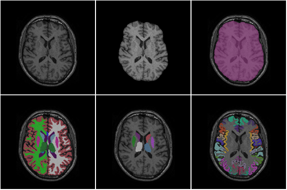

## Background

* This package provides deep-learning segmentation models.
* We also provided the stand-alone application working on Windows, Mac, and Linux.


## Tutorial using tigerseg

### Install stand-alone version
    https://github.com/htylab/tigerseg/releases

### Prerequisite: Install ONNXruntime 
    pip install onnxruntime-gpu
It is fine if you don't have GPU.

### Install package    
    pip install tigerseg
or
    pip install https://github.com/htylab/tigerseg/archive/release.zip    
or install the nightly unstable build:
    pip install git+https://github.com/htylab/tigerseg
    

## Usage

### As a command line tool:
For brain extraction:

    tigerbx -bmadf c:\data\*.nii.gz -o c:\output
    tigerbx -h (for more detail)

For cine cardiac MRI segmentation:

    cine4d -i c:\data\*.nii.gz -o c:\output


For VDM method on EPI images:

    vdm -i c:\data\*.nii.gz -o c:\output


### As a python module:

```
from tigerseg import segment

input_file_list = glob.glob(r"C:\sample\*o.nii")
result = segment.apply_files('cine4d_v0002_xyz_mms12acdc', input_file_list)

```
# Label names:

## cine4d
| Label No. | Structure Name            |
| --------- | ------------------------- |
| 1         | Left Ventricle blood      |
| 2         | Left Ventricle Myocardium |
| 3         | Right Ventricle blood     |

## ASEG
| Label | Structure              | Label | Structure               |
| ----- | ---------------------- | ----- | ----------------------- |
| 2     | Left Cerebral WM       | 41    | Right Cerebral WM       |
| 3     | Left Cerebral Cortex   | 42    | Right Cerebral Cortex   |
| 4     | Left Lateral Ventricle | 43    | Right Lateral Ventricle |
| 5     | Left Inf Lat Vent      | 44    | Right Inf Lat Vent      |
| 7     | Left Cerebellum WM     | 46    | Right Cerebellum WM     |
| 8     | Left Cerebellum Cortex | 47    | Right Cerebellum Cortex |
| 10    | Left Thalamus          | 49    | Right Thalamus          |
| 11    | Left Caudate           | 50    | Right Caudate           |
| 12    | Left Putamen           | 51    | Right Putamen           |
| 13    | Left Pallidum          | 52    | Right Pallidum          |
| 14    | 3rd Ventricle          | 53    | Right Hippocampus       |
| 15    | 4th Ventricle          | 54    | Right Amygdala          |
| 16    | Brain Stem             | 58    | Right Accumbens area    |
| 17    | Left Hippocampus       | 60    | Right VentralDC         |
| 18    | Left Amygdala          | 62    | Right vessel            |
| 24    | CSF                    | 63    | Right choroid plexus    |
| 26    | Left Accumbens area    | 77    | WM hypointensities      |
| 28    | Left VentralDC         | 85    | Optic Chiasm            |
| 30    | Left vessel            | 251   | CC Posterior            |
| 31    | Left choroid plexus    | 252   | CC Mid Posterior        |
|       |                        | 253   | CC Central              |
|       |                        | 254   | CC Mid Anterior         |
|       |                        | 255   | CC Anterior             |

## DeepGM: Deep gray-matter structures
| Label No. | Structure Name       | Label No. | Structure Name        |
| --------- | -------------------- | --------- | --------------------- |
| 1         | Left-Thalamus-Proper | 2         | Right-Thalamus-Proper |
| 3         | Left-Caudate         | 4         | Right-Caudate         |
| 5         | Left-Putamen         | 6         | Right-Putamen         |
| 7         | Left-Pallidum        | 8         | Right-Pallidum        |
| 9         | Left-Hippocampus     | 10        | Right-Hippocampus     |
| 11        | Left-Amygdala        | 12        | Right-Amygdala        |
