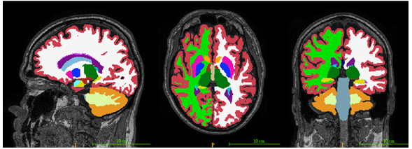

## Background
This package provides deep-learning segmentation models



## Tutorial using tigerseg

### Install package
    
    pip install tigerseg

or

    pip install https://github.com/htylab/tigerseg/archive/release.zip
    
or install the nightly unstable build:

    pip install git+https://github.com/htylab/tigerseg


## Usage

### As a command line tool:

    tigerseg -i INPUT_FILE -o OUTPUT_DIR --model model --GPU True --report True

INPUT_FILE: For example, t1.nii.gz. A wildcard is allowed. For example, you can use 

    tigerseg -i c:\data\*.nii.gz -o c:\output --model model


For subcortical segmentation:

    aseg -i c:\data\*.nii.gz -o c:\output

For cine cardiac MRI segmentation:

    cine4d -i c:\data\*.nii.gz -o c:\output

For skull-stripping on 3D T1-weighted images:

    tigerbet -i c:\data\*.nii.gz -o c:\output

For VDM method on EPI images:

    vdm -i c:\data\*.nii.gz -o c:\output


### As a python module:

```
from tigerseg import segment

input_file_list = glob.glob(r"C:\sample\*o.nii")
result = segment.apply_files('cine4d_v0002_xyz_mms12acdc', input_file_list)

```
# Label names:
## cine4d
1: LV blood pool, 2: Myocardium, 3: RV blood pool
## ASEG
| Label No. | Structure Name                | Label No. | Structure Name               |
| --------- | ----------------------------- | --------- | ---------------------------- |
| 2         | Left-Cerebral-White-Matter    | 49        | Right-Thalamus-Proper        |
| 4         | Left-Lateral-Ventricle        | 50        | Right-Caudate                |
| 5         | Left-Inf-Lat-Vent             | 51        | Right-Putamen                |
| 7         | Left-Cerebellum-White-Matter  | 52        | Right-Pallidum               |
| 8         | Left-Cerebellum-Cortex        | 53        | Right-Hippocampus            |
| 10        | Left-Thalamus-Proper          | 54        | Right-Amygdala               |
| 11        | Left-Caudate                  | 58        | Right-Accumbens-area         |
| 12        | Left-Putamen                  | 60        | Right-VentralDC              |
| 13        | Left-Pallidum                 | 62        | Right-vessel                 |
| 14        | 3rd-Ventricle                 | 63        | Right-choroid-plexus         |
| 15        | 4th-Ventricle                 | 72        | 5th-Ventricle                |
| 16        | Brain-Stem                    | 77        | WM-hypointensities           |
| 17        | Left-Hippocampus              | 78        | Left-WM-hypointensities      |
| 18        | Left-Amygdala                 | 79        | Right-WM-hypointensities     |
| 24        | CSF                           | 80        | non-WM-hypointensities       |
| 26        | Left-Accumbens-area           | 81        | Left-non-WM-hypointensities  |
| 28        | Left-VentralDC                | 82        | Right-non-WM-hypointensities |
| 30        | Left-vessel                   | 85        | Optic-Chiasm                 |
| 31        | Left-choroid-plexus           | 251       | CC\_Posterior                |
| 41        | Right-Cerebral-White-Matter   | 252       | CC\_Mid\_Posterior           |
| 43        | Right-Lateral-Ventricle       | 253       | CC\_Central                  |
| 44        | Right-Inf-Lat-Vent            | 254       | CC\_Mid\_Anterior            |
| 46        | Right-Cerebellum-White-Matter | 255       | CC\_Anterior                 |
| 47        | Right-Cerebellum-Cortex       |           |                              |
