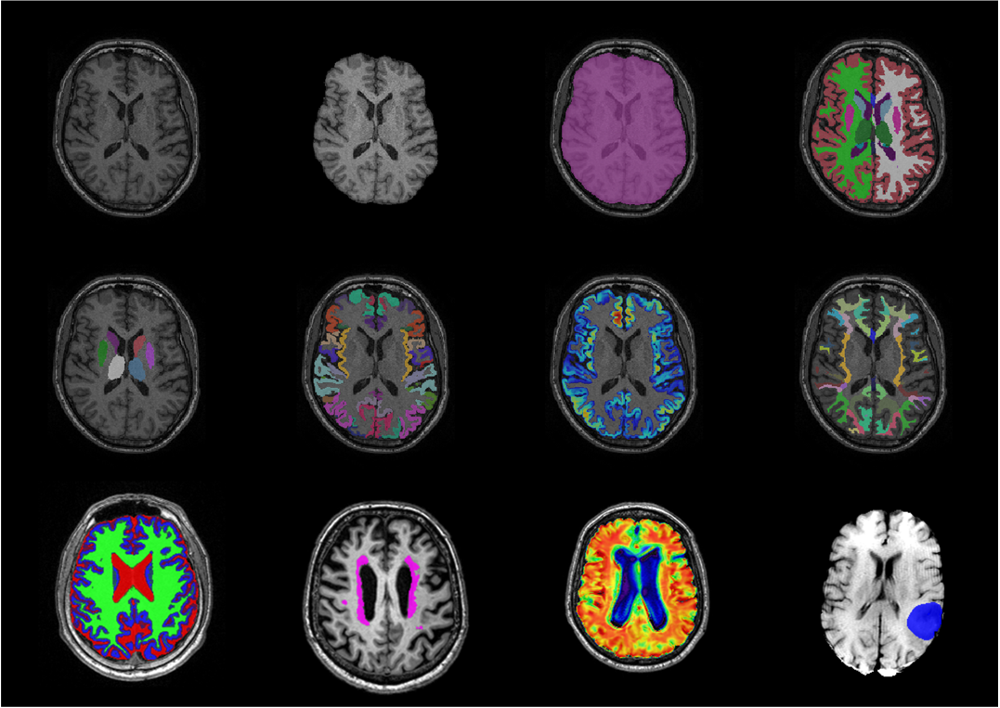

# TigerBx: Tissue Mask Generation for Brain Extraction


## Overview

**TigerBx** is a deep learning toolkit for brain extraction and tissue segmentation. It provides:

* Pretrained models for structural brain segmentation.
* A stand-alone application for Windows, macOS, and Linux.
* Python APIs for advanced users and scripting.
* Designed strictly for **research purposes only**—not for clinical or commercial use.


---

## Quick Start

### Install as a Python Package and perform segmentation

```bash
pip install onnxruntime              # For CPU
pip install --no-cache https://github.com/htylab/tigerbx/archive/release.zip
```

```python
import tigerbx

# Full segmentation pipeline
tigerbx.run('bmadk', 'T1w.nii.gz', 'output_dir')
```

### To install a specific archived version or gpu-enabled onnxruntime:

```bash
pip install onnxruntime-gpu          # For GPU
pip install https://github.com/htylab/tigerbx/archive/refs/tags/v0.1.18.tar.gz
```

---

## Python API Usage

### Brain Segmentation

```python
import tigerbx

# Full segmentation pipeline
tigerbx.run('bmadk', r'C:\T1w_dir', r'C:\output_dir')

# Input using wildcards
tigerbx.run('bmadk', r'C:\T1w_dir\**\*.nii.gz', r'C:\output_dir')

# Output to same directory
tigerbx.run('bmadk', r'C:\T1w_dir\**\*.nii.gz')

# Deep gray matter segmentation (with GPU)
tigerbx.run('dg', r'C:\T1w_dir')
```
See [run usage](doc/run.md) for a complete description of these APIs.

### Hierarchical Label Consolidation (HLC)

This module maps 171 FreeSurfer-style labels to 56 hierarchical regions for improved efficiency and reduced memory use. Also outputs:

* **Cortical thickness (CT)** maps
* **CSF/GM/WM probability (CGW)** maps

```python
import tigerbx
tigerbx.hlc('T1w_dir', 'outputdir')
```

```bash
tiger hlc T1w_dir -o outputdir
```

See [HLC usage](doc/hlc.md) for a complete description of these APIs.

### Registration and VBM

```python
# Standard registration
tigerbx.reg('r', r'C:\T1w_dir', r'C:\output_dir', template='template.nii.gz', save_displacement=False, affine_type='C2FViT')

# FuseMorph registration
tigerbx.reg('F', r'C:\T1w_dir', r'C:\output_dir', save_displacement=False)

# Voxel-Based Morphometry (VBM)
tigerbx.reg('v', r'C:\T1w_dir\**\*.nii.gz', r'C:\output_dir')

# Apply warp field
tigerbx.transform(r'C:\T1w_dir\moving.nii.gz', r'C:\T1w_dir\warp.npz', r'C:\output_dir', interpolation='nearest')
```
```bash
tiger reg -r C:\T1w_dir -o C:\output_dir -T template.nii.gz --affine_type C2FViT
tiger reg -F C:\T1w_dir -o C:\output_dir --affine_type ANTs
tiger reg -v C:\T1w_dir\**\*.nii.gz -o C:\output_dir --affine_type C2FViT
```
See [registration instructions](doc/reginstruction.md) for detailed usage guidelines on the various methods.

### Generative Displacement Mapping (GDM)

GDM is a referenceless method for correcting geometric distortions in EPI scans using a GAN-based displacement field predictor. It improves alignment between diffusion and T1-weighted images without requiring field maps or reversed gradients \[Kuo et al., 2025].

```python
# Single file
tigerbx.gdm('dti.nii.gz')

# Directory input with specified b0 index
tigerbx.gdm(r'C:\EPI_dir', r'C:\output_dir', b0_index=0)
```

### NERVE Embedding Pipeline

NERVE encodes hippocampus and amygdala patches into latent vectors using a variational autoencoder. These embeddings can be used for downstream neuroimaging tasks such as Alzheimer\u2019s disease detection.

```python
# Encode a T1-weighted image and save patches
tigerbx.nerve('ep', 'T1w.nii.gz', 'nerve_out')
```

See [NERVE usage](doc/nerve.md) for more examples.

### Utility Functions

```python
# Remove downloaded ONNX files
tigerbx.run('clean_onnx')

# Encode T1w images into latent space
tigerbx.run('encode', r'C:\T1w_dir', r'C:\output_dir')

# Decode from latent space back to image
tigerbx.run('decode', r'C:\npz_dir', r'C:\output_dir')
```

---

## Command-Line Usage

### Installation

Download the latest stand-alone release:
[https://github.com/htylab/tigerbx/releases](https://github.com/htylab/tigerbx/releases)

### Example Commands

```bash
tiger bx -bmad c:\data\*.nii.gz -o c:\output
tiger bx -c c:\data\*.nii.gz -o c:\output
tiger reg -r c:\data\*.nii.gz -o c:\output -T template.nii.gz
tiger gdm DTI.nii.gz -o c:\outputdir
```

---

## Supported Platforms

* ✅ Windows and macOS
* ✅ Ubuntu 20.04 or newer

---

## Command-Line Flag Reference

```text
-b: Brain mask
-a: ASEG segmentation
-d: Deep gray matter mask
-k: DKT segmentation (WIP)
-c: Cortical thickness
-C: CSF/GM/WM PVEs (FSL style, WIP)
-S: SynthSeg-style ASEG (WIP)
-t: Tumor segmentation (WIP)
-w: White matter parcellation (WIP)
-W: White matter hypointensity mask (WIP)
-q: Save QC score (watch for scores < 50)
-z: Output as .nii.gz
-A: Affine registration to template (default MNI152)
-r: Nonlinear registration to template (default MNI152)
-F: FuseMorph registration to template
-T: Template filename
-R: Rigid registration
-p: Enable patch inference (160×160×160)
-v: Run VBM analysis
```

---

## Citation

If you use TigerBx in your research, please cite the following:

1. **Weng JS, et al.** (2022) *Deriving a robust deep-learning model for subcortical brain segmentation by using a large-scale database: Preprocessing, reproducibility, and accuracy of volume estimation.* **NMR Biomed. 2022; e4880.** [https://doi.org/10.1002/nbm.4880](https://doi.org/10.1002/nbm.4880)
2. **Wang HC et al. .** (2024)
   *Comparative Assessment of Established and Deep Learning Segmentation Methods for Hippocampal Volume Estimation in Brain MRI Analysis.*
   **NMR in Biomedicine; e5169.**
   [https://doi.org/10.1002/nbm.5169](https://doi.org/10.1002/nbm.5169)
3. **Kuo CC, et al.** (2025).\* *Referenceless reduction of spin-echo echo-planar imaging distortion with generative displacement mapping.*
   **Magn Reson Med.** 2025; 1–16. [https://doi.org/10.1002/mrm.30577](https://doi.org/10.1002/mrm.30577)

---

## Label Definitions

See [Label definitions](doc/seglabel.md) for a full list of anatomical regions used in segmentation.

---

## Validation and Benchmarks

See [Validation](doc/validation.md) for details on accuracy, reproducibility, and comparison against other tools.

---

## Disclaimer

This software is intended solely for **research use** and has **not** been reviewed or approved by the FDA or any regulatory body. It must **not** be used for diagnostic, treatment, or other clinical purposes.

The software is provided **"as is"**, without warranty of any kind. The developers assume no responsibility for any consequences arising from the use of this software.
